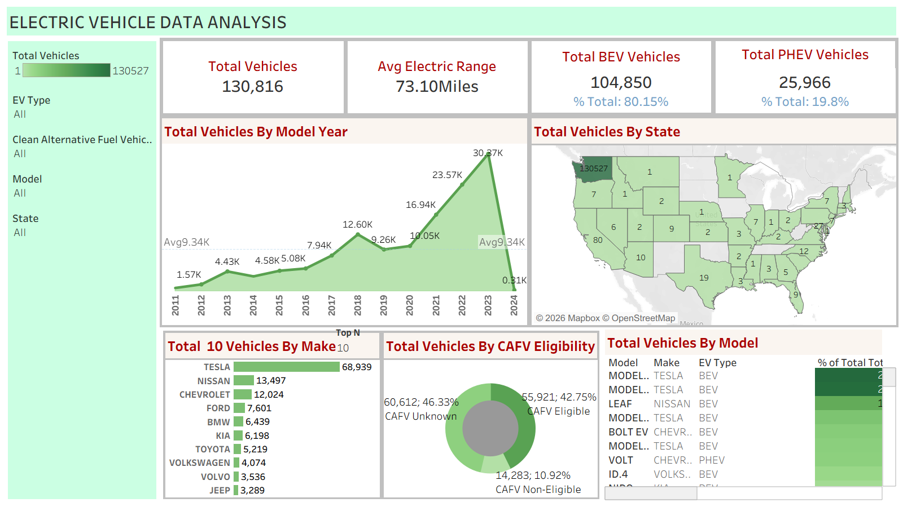

## Project Overview:
This project analyzes EV adoption using 150,000+ records. A Tableau dashboard highlights key metrics like vehicle count, range, technology split, and trends. Results show rapid growth after 2020, with BEVs dominating over 80% of the market, indicating a shift to full electrification.
The dashboard helps stakeholders understand market dynamics and identify patterns supporting the transition to sustainable mobility.
## Business Problem:
This project addresses the need to:
*	Analyze the current state of EV adoption across a large dataset of vehicles 
*	Understand the distribution between BEVs and PHEVs 
*	Identify leading manufacturers and market concentration 
*	Track adoption trends over time and across model years 
*	Evaluate geographic distribution of EV usage 
*	Assess CAFV eligibility and its implications on EV adoption 

## Datasource & Overview:
## Methodology:
## Key Calculations & Metrics:
## Dashboard:

## Skills:
* Tableau (Dashboard Development & Data Visualization)
* KPI Development & Calculated Fields (COUNTD, AVG)
* Data Cleaning & Transformation
* Exploratory Data Analysis (EDA)
* Trend & Time-Series Analysis
* Interactive Dashboard Design (Filters, User Interaction)
* Data Modeling & Structuring
* Market Segmentation & Comparative Analysis
* Business Intelligence & Data-Driven Insights
## Results & Recommendations:
## Next Steps:
